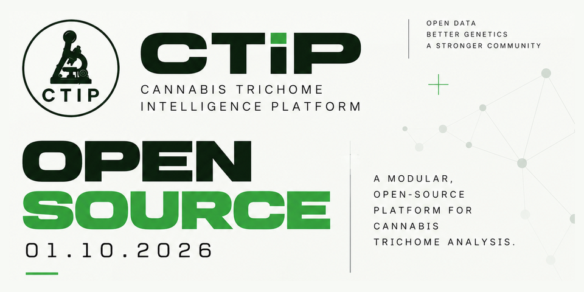

# CTIP — Cannabis Trichome Intelligence Platform

<p align="center"></p>

**Open-source microscopy computer vision for cannabis trichomes:** detection, instance segmentation, morphology,
optical maturity and size measurement, with an annotation and active-learning loop built around a human reviewer.

[](https://github.com/ottco-dev/ctip-oss/actions/workflows/ci.yml)
[](LICENSE)
[](https://www.python.org/)
[](#project-status)

> 📖 Full manuals: [English](docs/manual/en.md) · [Deutsch](docs/manual/de.md) · [Español](docs/manual/es.md) ·
> [Technology stack & rationale](docs/manual/tech-stack.md)

---

## Project status

CTIP is **alpha research software**. Read this before you use it:

- **No trained trichome model is shipped.** The platform contains the full pipeline to collect images, label them,
  train and evaluate — but no released weights. Setup downloads the generic COCO `yolo11s.pt` as a *starting point for
  fine-tuning*; it does not detect trichomes out of the box. You train on your own microscope images.
- **Accuracy figures in the manuals are targets, not results.** Numbers such as mAP50 > 0.88 or IoU > 0.82 are the
  goals the evaluation tooling checks against. No public trichome benchmark result exists yet.
- **What is measured:** runtime on an RTX 4060 — the full detection pipeline (1280 px, FP16: 95 ms, < 350 MB VRAM;
  4K tiled: 0.8 s) and the classical modules (focus, colour/texture features) — see
  [benchmark history](docs/progress/benchmark_history.md).
- **Tested:** 1694 unit tests, lint and the quickstart notebook run on every push (CPU, no GPU or external services).

## What it does

| Stage | Method |
|---|---|
| Image quality | Focus scoring (Laplacian, Tenengrad, FFT, composite), blurry frames rejected |
| Detection | YOLO11 with tiled inference (1280 px tiles, overlap merge), optional RTMDet ensemble |
| Segmentation | SAM2-tiny prompted from detection boxes, mask refinement |
| Morphology | Geometric features + optional CNN: capitate-stalked / sessile / bulbous / non-glandular |
| Optical maturity | Clear → cloudy → amber from HSV/LAB colour and LBP/GLCM/Gabor texture, calibrated confidence |
| Measurement | Pixel → µm via a calibration scale (stage micrometer) |
| Video | Frame quality ranking, temporal de-duplication, SORT tracking |
| Labelling | Label Studio / CVAT integration, VLM pre-labelling (Florence-2, Moondream, Qwen2-VL) and agent labelling with Claude Code + SAM2 (MCP), behind a mandatory human review gate |
| Active learning | Uncertainty and model-disagreement sampling for the next labelling batch |
| Inference | PyTorch, ONNX Runtime, TensorRT FP16; one GPU job at a time for 8 GB cards |
| Platform | FastAPI backend, Next.js 14 frontend, MLflow tracking, Docker Compose, setup wizard |

### What it is not

- **No THC, CBD or any cannabinoid prediction.** Maturity here is an *optical* observation of trichome heads. Amber
  colour is not a measurement of cannabinoid content or degradation.
- Not a substitute for lab analysis, and not a harvest guarantee.
- VLM output never goes straight into training data — every pre-label passes human review.

## Quick start (development)

Requirements: Linux (Ubuntu 22.04/24.04 tested), Python 3.12, Node.js 20, optional NVIDIA GPU with CUDA 12.
AMD ROCm, Apple MPS and CPU-only setups are covered in the [manual](docs/manual/en.md#2-hardware-requirements).

```bash
git clone https://github.com/ottco-dev/ctip-oss.git && cd ctip-oss

python3.12 -m venv .venv && source .venv/bin/activate
pip install uv && uv pip install -e ".[dev]"     # extras: [onnx] [agent] [vlm] [sam] [annotation] [remote_vlm] [wandb] [all]
# exact versions from uv.lock instead:  uv sync --extra dev

uvicorn backend.main:app --reload --port 8000     # API + docs at http://localhost:8000/docs
cd frontend && npm ci && npm run dev               # UI at http://localhost:3000
```

Or both at once: `./ctip.sh start` (also `stop`, `status`, `logs`).
**No GPU, no data?** Open [`notebooks/quickstart.ipynb`](notebooks/quickstart.ipynb): focus scoring, optical
maturity features, µm scale and the leakage-safe split on synthetic images.

On first start the UI opens the **setup wizard** (hardware, storage, services, security) and writes `.env`.
**Server without a GPU:** `docker/cpu/` builds the backend (CPU inference), web UI, MLflow and Label Studio:
`cd docker/cpu && cp ctip.env.example ctip.env` (set `API_TOKEN`), then `docker compose up -d --build`.

Docker Compose deployment, TensorRT, Label Studio/CVAT and remote access are covered in the
[manual](docs/manual/en.md#10-docker-deployment) and [docs/deployment](docs/deployment/).

### The workflow

1. **Collect** images with a consistent microscope, magnification and lighting ([image tips](docs/manual/en.md#5-data-collection--image-tips)).
2. **Calibrate** the pixel size with a stage micrometer.
3. **Label** in Label Studio, optionally pre-labelled by a VLM, always reviewed by a person.
4. **Split by session, not by image**, so near-identical frames never leak between train and test.
5. **Train** (YOLO11 detection, morphology CNN) with fixed seeds; runs are tracked in MLflow.
6. **Evaluate**: mAP, IoU, calibration (ECE, reliability diagrams), failure cases.
7. **Improve**: active learning picks the next images to label.

### Labelling with Claude Code

CTIP includes an MCP server that lets Claude Code label images like a careful annotator: it reads coordinates off a
grid, zooms, clicks each glandular head, SAM2 cuts the mask and a shape check trims stalks. Labels are saved as
*pending review* or pushed to Label Studio as predictions — a person approves every one.
Open the repo in Claude Code (`.mcp.json` registers the server) and run `/label-trichomes <folder>`.
See [docs/agent-labeling.md](docs/agent-labeling.md).

## Architecture

```
Image / video
  → focus filter → tiled detection (YOLO11) → confidence calibration
  → SAM2 segmentation → mask refinement
  → morphology + optical maturity → µm measurement → analytics & reports
```

Each scientific module (`detection/`, `segmentation/`, `maturity/`, `morphology/`, `measurement/`, `focus/`,
`video_pipeline/`, `vlm_labeling/`, `annotation/`, `active_learning/`, `training/`, `inference/`, `analytics/`)
is split into `domain/` (pure logic), `application/` (pipelines), `infrastructure/` (models, I/O) and `api/`.
Shared types live in `shared/`. The FastAPI app is in `backend/`, the UI in `frontend/`.

## Scientific approach and limitations

- **Calibration:** temperature / Platt scaling, reliability diagrams and ECE at every evaluation.
- **Uncertainty:** calibrated confidences, ensemble disagreement, and active learning on the uncertain cases.
- **Reproducibility:** global seed 42 for training, sampling and augmentation; deterministic session-based splits.
- **Leakage prevention:** splits by imaging session; tests cover it.
- **Background:** [research notes](docs/research/) — e.g. why trichome colour cannot be turned into a THC value.
- **Known limits:** colour features depend strongly on lighting and white balance — mixed setups degrade maturity
  estimates; sessile and bulbous trichomes are small and easily missed at low magnification; µm values are only as
  good as the calibration.

## Testing

```bash
pytest -m "not gpu and not integration"   # 1694 unit tests, CPU only (~1 min)
ruff check .                              # lint (enforced in CI)
pytest -m gpu                             # needs a CUDA GPU (and TensorRT for engine tests)
cd frontend && npx tsc --noEmit && npm run build
```

## Contributing

Contributions are welcome — especially **annotated microscope images under an open licence**, evaluation results on
your own hardware, and bug reports. Please describe data and models with the
[dataset card](docs/templates/dataset_card.md) and [model card](docs/templates/model_card.md) templates. See [CONTRIBUTING.md](CONTRIBUTING.md); security issues go to
[SECURITY.md](SECURITY.md).

## Licence

CTIP is licensed under the **GNU Affero General Public License v3.0 or later** — see [LICENSE](LICENSE). If you run a
modified version as a network service, you must offer its source to the users of that service. CTIP builds on
Ultralytics YOLO, which is itself AGPL-3.0.

Model weights you train belong to you; the licence of your images and labels is up to you.

## Citation

If CTIP helps your work, please cite it — see [CITATION.cff](CITATION.cff).

## Legal note

Cannabis cultivation is regulated differently around the world. CTIP is image-analysis software; make sure your use
complies with the law where you are.
